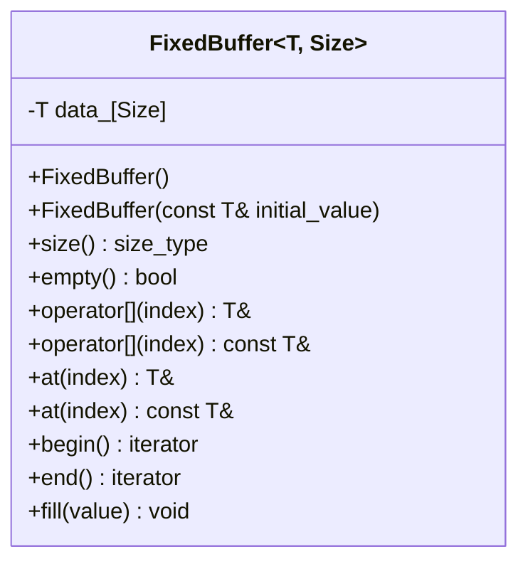

# Project 1: Const-Correct Fixed Buffer

## Project idea

Build a small, fixed-capacity container named `FixedBuffer<T, Size>`. It owns its elements directly, performs no dynamic allocation, supports indexed access, and works with range-based `for` loops.

This is intentionally similar to a small part of `std::array`. The goal is not to replace the standard library. The goal is to understand the language mechanisms behind a container-style interface.

## Learning goals

By completing this project, you should be able to explain and demonstrate:

- why a member initializer list constructs members directly;
- how `T&` and `const T&` communicate mutability;
- why a class commonly needs const and non-const overloads of `operator[]`;
- how the constness of the object participates in overload resolution;
- how pointers returned by `begin()` and `end()` support range-based `for`;
- how a class template produces a different type for each `T` and `Size`;
- when compiler-generated copy and move operations are sufficient;
- why fixed storage is useful in embedded systems.

Relevant notes:

- [References and pointers](../../01_cpp_references_vs_pointers.md)
- [Const correctness](../../03_const_correctness.md)
- [Constructors and initialization](../../04_constructors_destructors_initialization.md)
- [Copying and assignment](../../05_copy_constructor_and_copy_assignment.md)
- [Templates](../../11_cpp_templates_and_generic_programming.md)

## Required behavior

Implement this conceptual public interface:

```cpp
template <typename T, std::size_t Size>
class FixedBuffer {
public:
    using value_type = T;
    using size_type = std::size_t;
    using iterator = T*;
    using const_iterator = const T*;

    FixedBuffer();
    explicit FixedBuffer(const T& initial_value);

    [[nodiscard]] constexpr size_type size() const noexcept;
    [[nodiscard]] constexpr bool empty() const noexcept;

    T& operator[](size_type index) noexcept;
    const T& operator[](size_type index) const noexcept;

    T& at(size_type index);
    const T& at(size_type index) const;

    T& front();
    const T& front() const;
    T& back();
    const T& back() const;

    iterator begin() noexcept;
    const_iterator begin() const noexcept;
    iterator end() noexcept;
    const_iterator end() const noexcept;

    void fill(const T& value);

private:
    T data_[Size]{};
};
```

You may initially require `Size > 0`:

```cpp
static_assert(Size > 0, "FixedBuffer size must be greater than zero");
```

### Functional requirements

- Default construction value-initializes every element.
- The fill constructor initializes all elements to a supplied value.
- `operator[]` provides fast unchecked access.
- `at()` detects an invalid index and reports it clearly.
- A non-const buffer returns mutable references.
- A const buffer returns const references.
- Range-based `for` works for const and non-const buffers.
- `size()` does not store a redundant runtime size value.
- Copying one buffer produces an independent buffer.

## Why there are two `operator[]` functions

```cpp
T& operator[](size_type index) noexcept;
const T& operator[](size_type index) const noexcept;
```

The first function can be called on a non-const object. Returning `T&` allows modification:

```cpp
FixedBuffer<int, 4> values;
values[2] = 42;
```

The second function can be called on a const object. Its trailing `const` promises not to modify the observable state of the buffer, and its `const T&` return type prevents callers from modifying an element through that reference:

```cpp
const FixedBuffer<int, 4> values{7};
int x = values[2];       // allowed
// values[2] = 42;      // compilation error
```

Overloading only by return type is illegal. These functions are overloadable because one is a const member function and the other is not.

## High-level design



### Memory model

```mermaid
flowchart TB
    B[FixedBuffer<int, 4> object]
    B --> E0[data_[0]]
    B --> E1[data_[1]]
    B --> E2[data_[2]]
    B --> E3[data_[3]]
```

The array is part of the object. There is no separate heap allocation and no owning raw pointer, so the compiler-generated destructor, copy constructor, and copy-assignment operator are normally correct.

## Suggested file layout

```text
01_const_correct_fixed_buffer/
├── README.md
├── CMakeLists.txt
├── include/
│   └── fixed_buffer.hpp
├── src/
│   └── main.cpp
└── tests/
    └── fixed_buffer_tests.cpp
```

Because this is a class template, keep its complete definition in the header for now.

## Where to start

### Milestone 1: Storage and indexing

1. Declare `template <typename T, std::size_t Size>`.
2. Add `T data_[Size]{}`.
3. Implement `size()`, `empty()`, and both `operator[]` overloads.
4. Write a small `main()` that modifies a non-const buffer and reads a const buffer.

### Milestone 2: Iteration

1. Implement `begin()` as a pointer to the first element.
2. Implement `end()` as one-past-the-last element.
3. Add both const and non-const overloads.
4. Verify these loops compile:

```cpp
for (int& value : writable) {
    value += 1;
}

for (const int& value : read_only) {
    std::cout << value << '\n';
}
```

### Milestone 3: Checked access and useful operations

Implement `at()`, `front()`, `back()`, and `fill()`. Decide whether `at()` throws `std::out_of_range` or returns an optional reference-like result. For the first version, throwing is the simplest STL-like design.

### Milestone 4: Copy and move experiments

Do not initially write a copy constructor. Verify that the compiler-generated operations copy each array element:

```cpp
FixedBuffer<int, 4> original{5};
FixedBuffer<int, 4> copy = original;
copy[0] = 99;
// original[0] must still be 5
```

Create a small `Tracer` element type that prints from its constructors, assignments, and destructor. Store it in `FixedBuffer<Tracer, 3>` to observe what actually happens during copies and moves.

## Tests to write

- A default-constructed integer buffer contains zeroes.
- The fill constructor places the supplied value in every element.
- Writing through non-const `operator[]` changes the selected element.
- Reading through a const reference works.
- `at(Size)` reports an out-of-range access.
- `begin()` and `end()` visit exactly `Size` elements.
- A range-based loop can modify a non-const buffer.
- A range-based loop over a const buffer can read values.
- A copy is independent of the original.
- The type works with a user-defined element type, not only `int`.

Add compile-time interface checks where useful:

```cpp
static_assert(std::is_same_v<
    decltype(std::declval<FixedBuffer<int, 4>&>()[0]), int&>);

static_assert(std::is_same_v<
    decltype(std::declval<const FixedBuffer<int, 4>&>()[0]), const int&>);
```

## Hints

- The trailing `const` belongs to the member function; the leading `const` belongs to the returned element type.
- `end()` does not point to an element. It points one position past the final element and must not be dereferenced.
- `Size` is known at compile time. `size()` can return `Size` directly.
- Use `std::fill(begin(), end(), value)` to implement `fill()` after iteration works.
- Do not add `new`, `delete`, or an owning pointer. They are unnecessary here.
- `noexcept` is appropriate only for operations that cannot report errors. An `at()` implementation that throws must not be `noexcept`.
- If a const member function returns `T&`, callers may modify the buffer through a const object. That breaks const correctness.

## Design questions and tradeoffs

1. **Why return references from `operator[]`?** Returning by value would allow reading, but assignment such as `buffer[0] = 7` would not modify the stored element.
2. **Why have `at()` and `operator[]`?** Checked access is safer; unchecked access avoids the branch and matches STL container conventions.
3. **Raw array or `std::array`?** A raw array exposes the mechanisms more directly. `std::array<T, Size>` is preferable in production because it already provides a complete standard interface.
4. **Should zero-sized buffers work?** Supporting them correctly complicates raw-array storage. Rejecting them with `static_assert` is acceptable for this learning scope.
5. **Should move operations be written manually?** Usually no. The array already supplies correct value semantics, so the Rule of Zero is preferable.

## Interview practice

Be prepared to answer:

- How does the compiler choose between the two `operator[]` overloads?
- What is the difference between `const T&` in the return type and `const` after the parameter list?
- Why does this type not need a destructor?
- What makes range-based `for` work?
- What is copied by the compiler-generated copy constructor?
- Where are the elements stored when the buffer object is a local variable?
- What changes if `T` is expensive to copy?

## Definition of done

The project is complete when:

- all functional requirements are implemented;
- all tests pass with warnings enabled;
- no dynamic allocation is used;
- const code cannot modify elements;
- the buffer works in a range-based loop;
- you can explain why the Rule of Zero applies.

## Optional extensions

- Add reverse iterators.
- Add `data()` const and non-const overloads.
- Add `operator==`.
- Add `constexpr` where the implementation supports compile-time use.
- Constrain the template and improve compiler diagnostics.
- Replace the raw array with `std::array` and compare the two versions.

