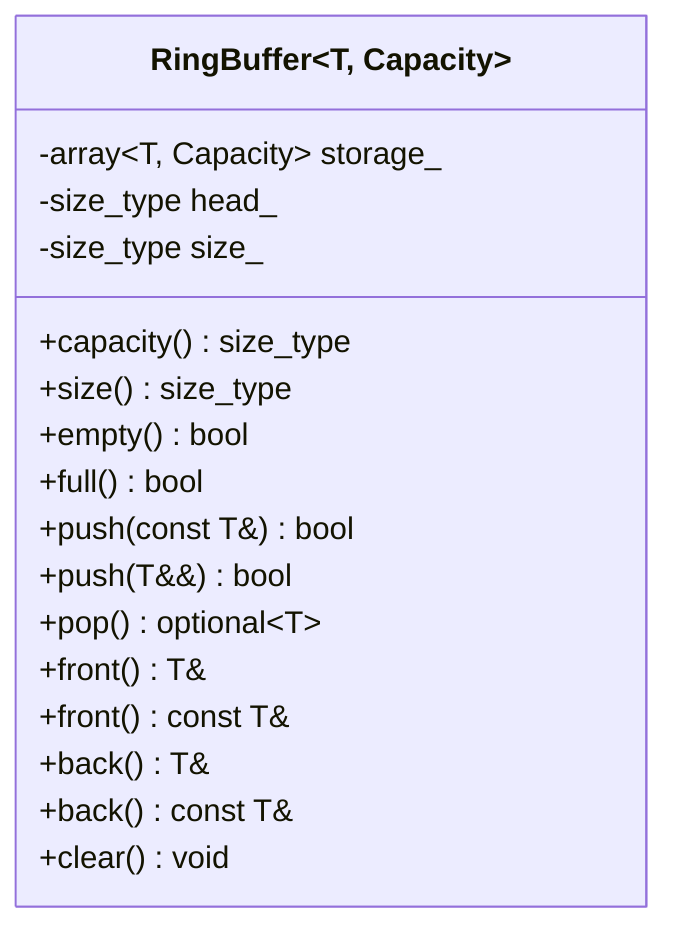
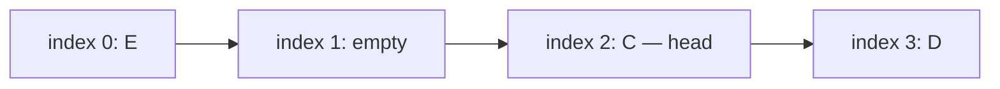
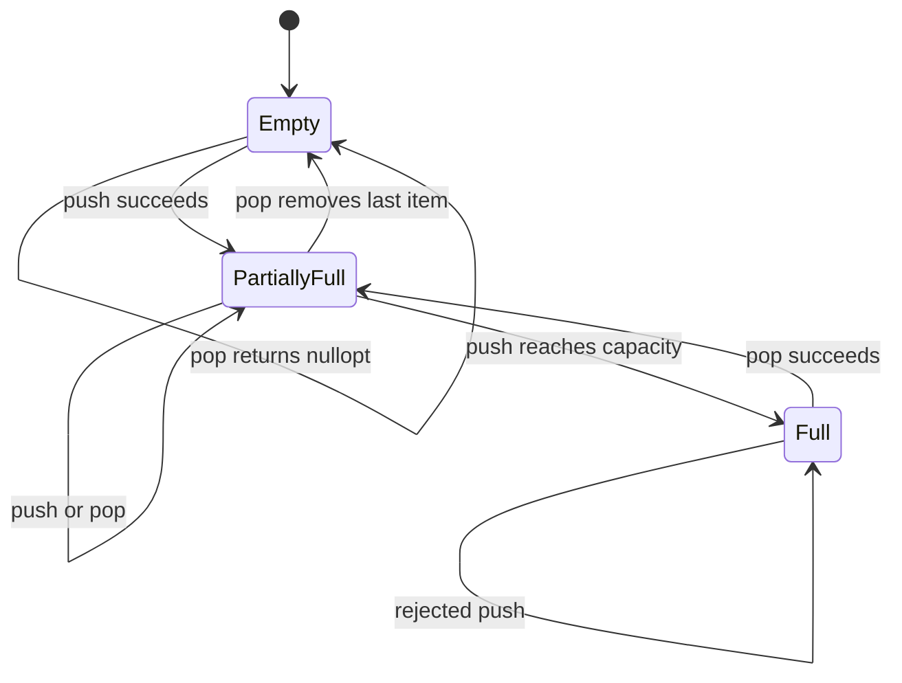

# Project 2: Ring Buffer

## Project idea

Build a fixed-capacity first-in, first-out container named `RingBuffer<T, Capacity>`. When the physical end of its storage is reached, the next logical position wraps back to index zero.

Ring buffers are common in embedded systems, device drivers, audio processing, networking, and producer/consumer pipelines because storage can be allocated in advance and normal operations can run in constant time.

## Learning goals

- Maintain class invariants across every operation.
- Separate logical ordering from physical array positions.
- Use modular arithmetic safely.
- Design const and non-const accessors.
- Support copying and moving without owning raw pointers.
- Compare error-reporting and full-buffer policies.
- Understand which operations depend on properties of `T`.
- Prepare a container for later use by the vehicle simulator.

Relevant notes:

- [Const correctness](../../03_const_correctness.md)
- [Copying and assignment](../../05_copy_constructor_and_copy_assignment.md)
- [Modern C++](../../09_modern_cpp_language_features_and_iteration.md)
- [Templates](../../11_cpp_templates_and_generic_programming.md)
- [STL containers and algorithms](../../12_cpp_standard_template_library_stl.md)

## Core terminology

- **Capacity:** maximum number of stored elements; fixed at compile time.
- **Size:** number of elements currently stored.
- **Head:** physical index of the oldest element.
- **Tail:** physical position where the next element will be inserted.
- **Wraparound:** mapping a position after the final array slot back to slot zero.

Choose one representation and document it. This project uses `head_` plus `size_`; the insertion index is calculated rather than stored:

```cpp
tail = (head_ + size_) % Capacity;
```

## Required behavior

Suggested interface:

```cpp
template <typename T, std::size_t Capacity>
class RingBuffer {
public:
    using value_type = T;
    using size_type = std::size_t;

    static_assert(Capacity > 0);

    [[nodiscard]] constexpr size_type capacity() const noexcept;
    [[nodiscard]] size_type size() const noexcept;
    [[nodiscard]] bool empty() const noexcept;
    [[nodiscard]] bool full() const noexcept;

    bool push(const T& value);
    bool push(T&& value);
    std::optional<T> pop();

    T& front();
    const T& front() const;
    T& back();
    const T& back() const;

    void clear() noexcept;

private:
    std::array<T, Capacity> storage_{};
    size_type head_{0};
    size_type size_{0};
};
```

For the first version, restrict `T` to types that can be default-constructed because `std::array<T, Capacity> storage_{}` constructs every slot. The optional extensions describe how to remove this restriction.

### Full-buffer policy

Use a **reject-new-value** policy:

- `push()` returns `false` when the buffer is full.
- Existing unread values remain unchanged.
- The caller decides whether to retry, discard, or report an error.

This policy is explicit and easy to test. An overwrite-oldest policy is a useful later extension, but do not silently mix the two behaviors.

### Empty-buffer policy

- `pop()` returns `std::nullopt` when empty.
- `front()` and `back()` require a non-empty buffer. You may assert, throw, or add checked alternatives such as `try_front()`.
- Document the choice in the public interface.

## High-level design



### Wraparound example

The logical queue contains `C, D, E`, but its elements are split across the physical end of the array:



Logical iteration starts at `head_`, not necessarily physical index zero.

### State transitions



## Invariants

Write these rules as comments near the representation and check them mentally after every operation:

- `head_ < Capacity`;
- `size_ <= Capacity`;
- `empty()` is equivalent to `size_ == 0`;
- `full()` is equivalent to `size_ == Capacity`;
- the oldest value is at `storage_[head_]` when non-empty;
- the next insertion position is `(head_ + size_) % Capacity`;
- after removing an element, `head_` advances modulo `Capacity`;
- `clear()` restores `head_ == 0` and `size_ == 0`.

## Suggested file layout

```text
02_ring_buffer/
├── README.md
├── CMakeLists.txt
├── include/
│   └── ring_buffer.hpp
├── src/
│   └── main.cpp
└── tests/
    └── ring_buffer_tests.cpp
```

Keep the template definition in its header.

## Where to start

### Milestone 1: Integer-only prototype

Before writing the template, simulate a capacity-four ring buffer on paper. Record `head_`, `size_`, and physical contents after:

```text
push A, push B, push C, pop, pop, push D, push E, push F
```

Then implement only `push`, `pop`, `empty`, `full`, and `size` for `int`.

### Milestone 2: Convert it into a template

Replace the fixed type and capacity with `T` and `Capacity`. Add a compile-time capacity check. Confirm that `RingBuffer<std::string, 8>` works.

### Milestone 3: Const-correct element access

Implement const and non-const versions of `front()` and `back()`. Compute the back index carefully:

```cpp
const auto index = (head_ + size_ - 1) % Capacity;
```

Only perform this calculation after confirming the buffer is non-empty, because unsigned subtraction from zero wraps.

### Milestone 4: Copy and move behavior

Test the compiler-generated copy operations. Because the buffer owns its `std::array` by value, a copied ring buffer should have independent storage but identical logical state.

Add `push(T&&)` and use `std::move(value)` when placing the value into storage. Use a tracer type to distinguish copying from moving.

### Milestone 5: Integration-quality API

Add `clear()`, checked access behavior, documentation, and a complete test suite. Only then consider iterators or concurrency.

## Tests to write

- A new buffer is empty and not full.
- Values leave in the same order they entered.
- `pop()` on an empty buffer returns `std::nullopt`.
- A rejected push does not alter a full buffer.
- `size()` is correct after every push and pop.
- Head and insertion positions wrap around correctly.
- A capacity-one buffer works.
- `front()` and `back()` refer to the correct elements.
- Const access returns const references.
- `clear()` restores the empty state after wraparound.
- Copies are independent, including after wraparound.
- Rvalue insertion moves when the element type supports moving.

The most valuable test repeatedly compares your ring buffer to `std::deque` under a long sequence of generated pushes and pops.

## Hints

- Do not use `head_ == tail_` alone to distinguish empty from full; those states can have the same indices. Keeping `size_` removes that ambiguity.
- Use one small helper for physical index calculation if the formula appears repeatedly.
- Update the stored element and bookkeeping in an order that preserves sensible behavior if element assignment throws.
- `std::move` does not move anything by itself; it permits a move-enabled overload to be selected.
- `std::optional<T>` makes the absence of a popped value explicit.
- Avoid adding a mutex to this project. Thread safety belongs in a separate wrapper in the final simulator.
- Start without custom iterators. Logical iteration over wrapped storage is more complex than returning raw pointers.

## Design questions and tradeoffs

1. **Reject or overwrite when full?** Rejecting preserves unread data. Overwriting is useful when only the newest samples matter. The correct choice depends on the system requirement.
2. **Return `bool`, `optional`, or an error enum?** `bool` is small but carries little explanation. `optional<T>` represents value-or-no-value. An enum can distinguish multiple failures.
3. **Store `head_` and `size_`, or `head_` and `tail_`?** Size makes full versus empty unambiguous, while two indices may require a flag or sacrifice one slot.
4. **Use fixed or dynamic capacity?** Fixed capacity gives predictable storage and no allocation. Dynamic capacity is more flexible but changes timing and ownership concerns.
5. **Use `std::array<T, N>` or uninitialized storage?** `std::array` is safe and simple but constructs all slots. Manual lifetime management supports non-default-constructible types but is advanced and easier to get wrong.

## Interview practice

- Explain the difference between physical and logical ordering.
- State the time and space complexity of `push()` and `pop()`.
- Explain how full and empty states are distinguished.
- What happens if `Capacity` is one?
- Is this implementation thread-safe? Why not?
- Why can the compiler-generated copy constructor be correct here?
- How would you support move-only, non-default-constructible types?
- When would overwrite-oldest behavior be preferable?

## Definition of done

- Push and pop are constant time.
- No allocation occurs during normal operations.
- Wraparound and boundary tests pass.
- Full and empty behavior is documented and tested.
- Const access is enforced by the type system.
- Copy and move experiments behave as expected.
- You can draw the state after an arbitrary operation sequence.

## Optional extensions

- Add an overwrite-oldest policy as a template policy or separate member function.
- Add logical iterators that traverse oldest to newest.
- Add bulk `push` and `pop` with `std::span`.
- Replace preconstructed slots with `std::optional<T>` slots.
- As an advanced exercise, use raw storage with `std::construct_at` and `std::destroy_at`.
- Add a thread-safe adapter in the vehicle simulator rather than coupling synchronization to this container.

