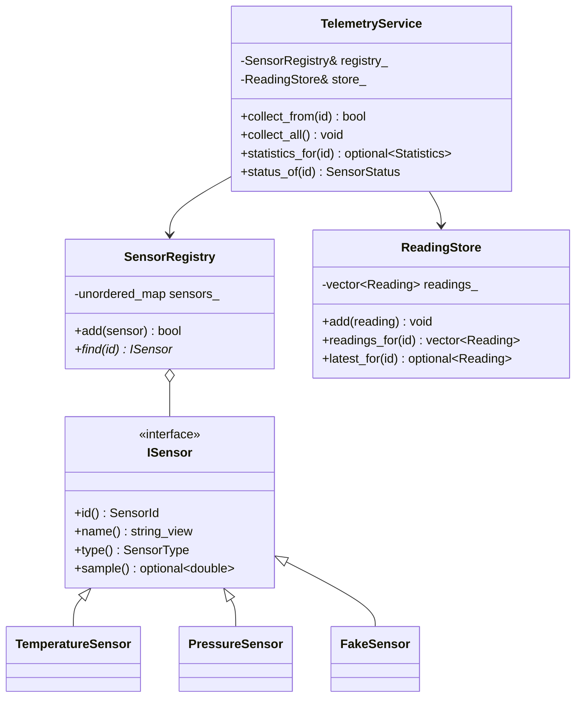
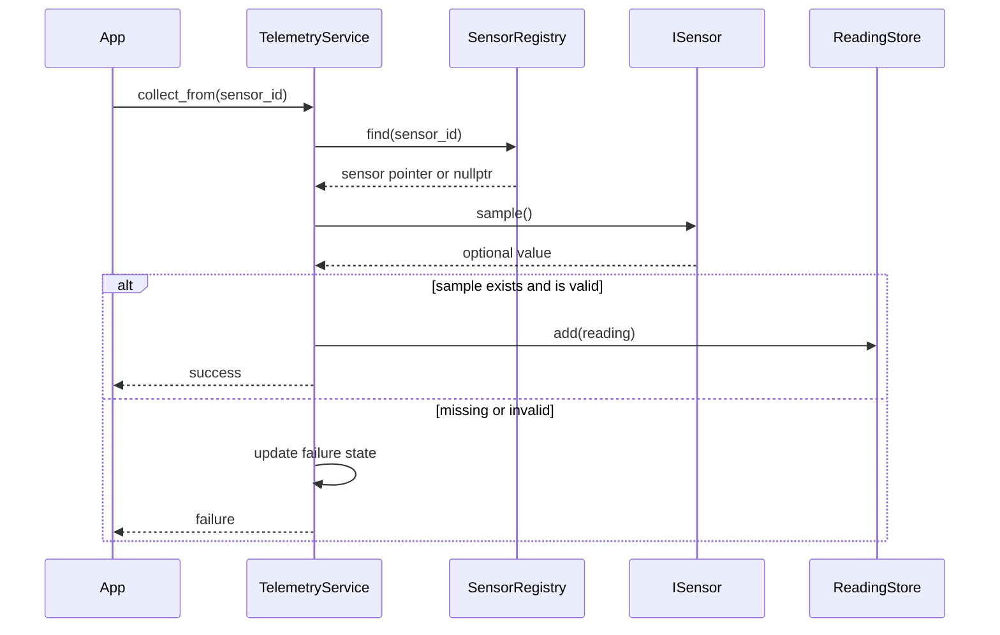
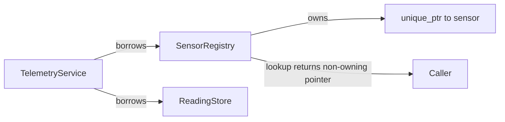

# Project 3: Sensor Telemetry System

## Project idea

Build a console-based system that registers different kinds of sensors, collects readings, rejects invalid data, calculates statistics, and reports sensor health.

The project should simulate hardware. It must not depend on a physical device. A deterministic fake data source makes tests repeatable and lets you focus on C++ design.

## Learning goals

- Organize related types in namespaces.
- Model concepts with classes and scoped enums.
- Use a small polymorphic interface where runtime substitution is useful.
- Express ownership with `std::unique_ptr`.
- Store and query data using STL containers.
- Use algorithms, lambdas, and ranges rather than manual indexing loops where appropriate.
- Represent a missing reading with `std::optional`.
- Separate acquisition, validation, storage, analysis, and presentation.
- Inject fake dependencies for testing.

Relevant notes:

- [Namespaces and overloading](../../06_namespaces_and_overloading.md)
- [Modern C++](../../09_modern_cpp_language_features_and_iteration.md)
- [Templates](../../11_cpp_templates_and_generic_programming.md)
- [STL containers and algorithms](../../12_cpp_standard_template_library_stl.md)

## Scope

Support at least two sensor types:

- temperature, measured in degrees Celsius;
- pressure, measured in kilopascals.

Each sensor has a unique ID, a readable name, a type, an allowed measurement range, and a way to produce a sample. The telemetry system stores accepted readings and counts failures.

Keep units simple and explicit. Do not silently compare a pressure value to temperature limits.

## Domain model

Start with these value types:

```cpp
namespace telemetry {

using SensorId = std::uint32_t;

enum class SensorType {
    temperature,
    pressure
};

enum class SensorStatus {
    healthy,
    degraded,
    failed
};

struct Reading {
    SensorId sensor_id;
    SensorType type;
    double value;
    std::chrono::steady_clock::time_point timestamp;
};

struct Statistics {
    double minimum;
    double maximum;
    double average;
    std::size_t sample_count;
};

} // namespace telemetry
```

A strong class for each physical quantity is a useful extension, but beginning with `double` keeps the first milestone approachable.

## Suggested interfaces

```cpp
namespace telemetry {

class ISensor {
public:
    virtual ~ISensor() = default;

    [[nodiscard]] virtual SensorId id() const noexcept = 0;
    [[nodiscard]] virtual std::string_view name() const noexcept = 0;
    [[nodiscard]] virtual SensorType type() const noexcept = 0;
    [[nodiscard]] virtual std::optional<double> sample() = 0;
};

class SensorRegistry {
public:
    bool add(std::unique_ptr<ISensor> sensor);
    ISensor* find(SensorId id) noexcept;
    const ISensor* find(SensorId id) const noexcept;

private:
    std::unordered_map<SensorId, std::unique_ptr<ISensor>> sensors_;
};

class ReadingStore {
public:
    void add(Reading reading);
    [[nodiscard]] std::vector<Reading> readings_for(SensorId id) const;
    [[nodiscard]] std::optional<Reading> latest_for(SensorId id) const;

private:
    std::vector<Reading> readings_;
};

class TelemetryService {
public:
    TelemetryService(SensorRegistry& registry, ReadingStore& store);

    bool collect_from(SensorId id);
    void collect_all();
    [[nodiscard]] std::optional<Statistics> statistics_for(SensorId id) const;
    [[nodiscard]] SensorStatus status_of(SensorId id) const;

private:
    SensorRegistry& registry_;
    ReadingStore& store_;
};

} // namespace telemetry
```

This is a design target, not a requirement to type everything before testing. You may refine return types when you identify errors that need more information than `bool` can provide.

## Functional requirements

### Sensor registration

- Register a sensor by transferring a `std::unique_ptr<ISensor>` into the registry.
- Reject null pointers.
- Reject duplicate sensor IDs.
- Look up sensors without transferring ownership.
- Provide both const and non-const lookup functions.

### Collection

- Ask a registered sensor for a sample.
- Treat `std::nullopt` as an acquisition failure.
- Reject values outside the configured valid range.
- Timestamp and store accepted readings.
- Track consecutive failures separately from total failures.
- Reset the consecutive-failure count after a valid reading.

### Queries and statistics

- Find the latest reading for a sensor.
- Filter readings by sensor ID and optionally by type.
- Calculate minimum, maximum, average, and sample count.
- Return `std::nullopt` when statistics do not exist because no valid readings are available.
- List unhealthy sensors.

### Health policy

Use an explicit initial policy:

- `healthy`: zero consecutive failures;
- `degraded`: one or two consecutive failures;
- `failed`: three or more consecutive failures.

Place the thresholds in one named location rather than scattering numeric literals through the code.

## High-level design



### Collection sequence



## Ownership and lifetime



The registry owns sensors. The service only borrows the registry and store, so they must outlive the service. State this precondition in the constructor documentation.

## Suggested file layout

```text
03_sensor_telemetry_system/
├── README.md
├── CMakeLists.txt
├── include/telemetry/
│   ├── sensor.hpp
│   ├── sensor_registry.hpp
│   ├── reading_store.hpp
│   ├── telemetry_service.hpp
│   └── types.hpp
├── src/
│   ├── sensor_registry.cpp
│   ├── reading_store.cpp
│   ├── telemetry_service.cpp
│   └── main.cpp
└── tests/
    ├── fake_sensor.hpp
    └── telemetry_tests.cpp
```

## Where to start

### Milestone 1: Value types and one fake sensor

Define the enums and structs. Implement `ISensor` and a `FakeSensor` that returns values from a predefined sequence. This makes failure cases controllable:

```cpp
std::vector<std::optional<double>> scripted_values;
```

Do not begin with randomness. Random tests make failures harder to reproduce.

### Milestone 2: Registry and ownership

Implement registration and lookup. Test duplicate IDs, null registration, successful lookup, and destruction through the interface. Verify that `ISensor` has a virtual destructor.

### Milestone 3: Reading storage and queries

Store readings in a `std::vector`. Implement `latest_for()` first with a reverse search, then implement filtering. Prefer standard algorithms or ranges when they improve clarity.

### Milestone 4: Collection and validation

Implement `TelemetryService::collect_from()`. Separate these cases in tests:

1. unknown sensor ID;
2. sensor returns no value;
3. sensor returns an out-of-range value;
4. sensor returns a valid value.

### Milestone 5: Statistics and health

Calculate statistics without dividing by zero. Add consecutive-failure tracking and the health policy. Print a concise console report.

### Milestone 6: Modern C++ cleanup

Review manual loops. Replace only those that become clearer with `std::find_if`, `std::minmax_element`, `std::accumulate`, lambdas, or C++20 ranges. Do not use an algorithm merely to avoid writing a readable loop.

## Tests to write

- A sensor can be registered and found.
- Duplicate and null registrations fail without changing the registry.
- Owned sensors are destroyed when the registry is destroyed.
- Unknown IDs produce a clear failure.
- Missing and invalid samples are not stored.
- Valid samples are timestamped and stored.
- Latest-reading lookup is correct.
- Statistics are absent for no data and correct for known data.
- Health changes after consecutive failures and recovers after success.
- Filtering never mixes readings from different sensors.
- Const registry lookup cannot modify the returned sensor through that pointer.

## Hints

- Use `enum class`, not an unscoped enum, to avoid accidental integer conversion and name collisions.
- `std::unique_ptr` expresses exclusive ownership; pass it by value into `add()` and move it into the container.
- A raw pointer returned by `find()` can be a valid non-owning observer. Raw pointers are not automatically bad; ambiguous ownership is the problem.
- If `find()` has const and non-const overloads, their return types should preserve constness.
- `std::optional<double>` means either a value or no value. It does not explain why sampling failed; an error enum or result type can be added later.
- Prefer `std::chrono::steady_clock` for elapsed-time ordering. It is monotonic and is not affected by wall-clock corrections.
- Avoid storing `std::string_view` unless the referenced string is guaranteed to outlive the view.
- Keep console printing outside the core classes so tests can inspect data directly.

## Design questions and tradeoffs

1. **Inheritance or `std::variant`?** An interface supports open-ended runtime sensor types. A variant keeps alternatives closed and avoids virtual dispatch. Implement inheritance first, then compare.
2. **`vector` or `deque` for readings?** A vector provides compact storage and fast iteration. A deque may be better if old readings are frequently removed from the front.
3. **`map` or `unordered_map` for the registry?** An unordered map gives average constant-time lookup; a map provides ordering and deterministic ordered iteration.
4. **Return copies or views from queries?** Copies are simple and safe. Views avoid allocation but introduce lifetime and invalidation concerns.
5. **Exceptions or explicit error values?** Expected operational failures such as a missing sample are usually clearer as values. Exceptional construction or programming errors may justify exceptions.

## Interview practice

- Why must a polymorphic base class usually have a virtual destructor?
- Who owns each object in this design?
- Why is `unique_ptr` preferable to a raw owning pointer?
- What does `optional` express that a sentinel value cannot?
- When would `unordered_map` perform worse than `map`?
- Explain dependency injection using `FakeSensor`.
- Which loops are good candidates for algorithms, and which are clearer as loops?
- How would you make unit mistakes impossible at compile time?

## Definition of done

- At least two sensor implementations work through `ISensor`.
- Ownership is explicit and there are no manual `delete` calls.
- Invalid readings cannot enter the reading store.
- Statistics and health policies are tested.
- Queries use STL tools clearly and correctly.
- The core library has no dependency on console input/output.
- Tests use deterministic fake sensors.

## Optional extensions

- Introduce `Temperature` and `Pressure` strong types.
- Add a maximum history size per sensor.
- Export accepted readings to CSV.
- Add calibration policies.
- Replace the virtual interface with `std::variant` and compare designs.
- Add C++23 `std::expected` or a custom result type with detailed acquisition errors.
- Feed readings into the ring buffer instead of an unbounded vector.

