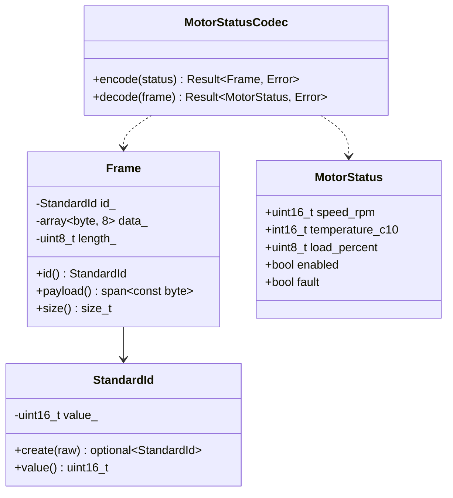
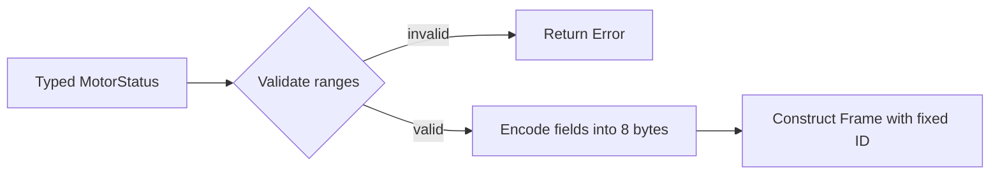
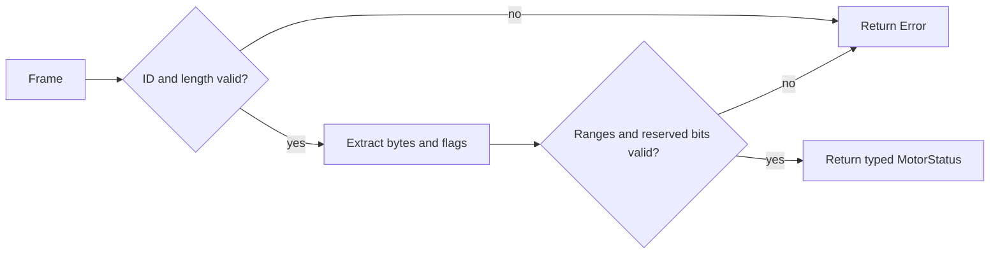

# Project 4: Embedded CAN Message Library

## Project idea

Build a small library for constructing, validating, encoding, and decoding classic CAN data frames. The project models the message layer only; it does not communicate with a physical CAN controller.

A classic CAN frame can carry up to eight data bytes. This constraint makes it an excellent exercise in fixed-size storage, byte manipulation, explicit validation, and allocation-free design.

> This is a learning library, not production automotive software. Real systems must follow their network specification, controller API, safety process, timing requirements, and protocol standards.

## Learning goals

- Use `std::array<std::byte, 8>` for fixed-capacity binary storage.
- Represent IDs and lengths with types that enforce invariants.
- Encode and decode unsigned values explicitly.
- Understand shifts, masks, byte order, and integer promotion.
- Accept non-owning buffers with `std::span`.
- Design templates for reusable codecs.
- Report malformed input without dynamic allocation.
- Keep protocol interpretation separate from byte transport.

Relevant notes:

- [Modern C++](../../09_modern_cpp_language_features_and_iteration.md)
- [C++ version comparison](../../10_cpp_standards_and_version_comparison.md)
- [Templates](../../11_cpp_templates_and_generic_programming.md)
- [STL](../../12_cpp_standard_template_library_stl.md)

## Scope and assumptions

Implement classic data frames with:

- an 11-bit standard identifier in the range `0x000` through `0x7FF`;
- a payload length from zero through eight;
- exactly eight bytes of owned storage, of which only `length` bytes are active;
- explicit big-endian and little-endian integer encoding;
- no heap allocation during frame construction, encoding, or decoding.

Extended 29-bit identifiers, remote frames, CAN FD, physical transmission, arbitration, and timing are outside the first version.

## Core types

```cpp
namespace can {

enum class Error {
    invalid_id,
    payload_too_large,
    value_out_of_range,
    malformed_payload,
    wrong_message_id
};

enum class ByteOrder {
    little_endian,
    big_endian
};

class StandardId {
public:
    static std::optional<StandardId> create(std::uint16_t raw) noexcept;
    [[nodiscard]] std::uint16_t value() const noexcept;

private:
    explicit StandardId(std::uint16_t raw) noexcept;
    std::uint16_t value_;
};

class Frame {
public:
    static constexpr std::size_t max_payload_size{8};

    Frame(StandardId id, std::span<const std::byte> payload);

    [[nodiscard]] StandardId id() const noexcept;
    [[nodiscard]] std::span<const std::byte> payload() const noexcept;
    [[nodiscard]] std::size_t size() const noexcept;

private:
    StandardId id_;
    std::array<std::byte, max_payload_size> data_{};
    std::uint8_t length_{0};
};

} // namespace can
```

If you want construction without exceptions, use a factory returning a small result type. C++20 does not provide `std::expected`; C++23 does. A custom `Result<T, Error>` or a result struct is suitable for this exercise.

## Message to implement

Define one realistic application message, for example:

```cpp
struct MotorStatus {
    std::uint16_t speed_rpm;       // 0..12000
    std::int16_t temperature_c10;  // degrees Celsius multiplied by 10
    std::uint8_t load_percent;     // 0..100
    bool enabled;
    bool fault;
};
```

Assign a fixed CAN ID and define the payload layout before writing codec code:

| Byte | Bits | Meaning |
|---:|---:|---|
| 0–1 | 16 | Speed in RPM, big-endian |
| 2–3 | 16 | Temperature × 10, signed, big-endian |
| 4 | 8 | Load percentage |
| 5 | 0 | Enabled flag |
| 5 | 1 | Fault flag |
| 5 | 2–7 | Reserved, encode as zero |
| 6–7 | 16 | Reserved, encode as zero |

The decoder must validate the ID, payload length, load range, and reserved bits.

## Required behavior

### Frame layer

- Reject invalid standard IDs.
- Reject payloads longer than eight bytes.
- Value-initialize unused bytes.
- Expose active payload through a read-only `std::span`.
- Do not expose mutable internal storage without a clear reason.

### Byte helpers

- Encode and decode 16-bit unsigned integers in both byte orders.
- Encode and decode signed 16-bit values without relying on pointer reinterpretation.
- Set, clear, and test individual flag bits.
- Reject output spans that are too small.

### Application codec

- Convert `MotorStatus` to a valid `Frame`.
- Convert a matching valid frame back to `MotorStatus`.
- Reject values outside specified ranges.
- Reject an unexpected CAN ID or payload size.
- Reject nonzero reserved bits.
- Ensure encode followed by decode preserves every field.

## High-level design



### Encoding pipeline



### Decoding pipeline



## Suggested file layout

```text
04_embedded_can_message_library/
├── README.md
├── CMakeLists.txt
├── include/can/
│   ├── byte_codec.hpp
│   ├── frame.hpp
│   ├── motor_status.hpp
│   └── result.hpp
├── src/
│   ├── frame.cpp
│   ├── motor_status.cpp
│   └── main.cpp
└── tests/
    ├── byte_codec_tests.cpp
    ├── frame_tests.cpp
    └── motor_status_tests.cpp
```

Template byte helpers should be defined in headers. Non-template implementation can live in source files.

## Where to start

### Milestone 1: Draw the bytes by hand

Encode this example on paper before coding:

```text
speed_rpm      = 1000       = 0x03E8
temperature_c10 = 255       = 0x00FF
load_percent   = 50         = 0x32
enabled        = true
fault          = false
```

For the proposed big-endian layout, the expected payload begins:

```text
03 E8 00 FF 32 01 00 00
```

This becomes your first known-answer test.

### Milestone 2: Standard ID and frame

Implement `StandardId` validation. Then implement `Frame` construction and read-only payload access. Test boundary IDs `0x000`, `0x7FF`, and invalid `0x800`.

### Milestone 3: Byte helpers

Write small functions such as:

```cpp
bool write_u16(std::span<std::byte> output,
               std::uint16_t value,
               ByteOrder order) noexcept;

std::optional<std::uint16_t>
read_u16(std::span<const std::byte> input,
         ByteOrder order) noexcept;
```

Test them independently before building the message codec.

### Milestone 4: Motor status codec

Implement range validation and encoding. Then implement decoding as the inverse. Test every error path rather than only the successful round trip.

### Milestone 5: Generic codec pattern

After one concrete codec works, explore a template customization point:

```cpp
template <typename Message>
struct Codec;

template <>
struct Codec<MotorStatus> {
    static Result<Frame, Error> encode(const MotorStatus& message);
    static Result<MotorStatus, Error> decode(const Frame& frame);
};
```

Do not start with this abstraction. Generalize only after the concrete behavior is understood.

## Bit-operation reminders

Set bit `n`:

```cpp
value |= static_cast<std::uint8_t>(1U << n);
```

Clear bit `n`:

```cpp
value &= static_cast<std::uint8_t>(~(1U << n));
```

Test bit `n`:

```cpp
const bool set = (value & static_cast<std::uint8_t>(1U << n)) != 0U;
```

Use unsigned types for shifts and masks. Be explicit about casts because small integer types are promoted to `int` in many expressions.

## Tests to write

- Standard ID accepts both boundaries and rejects values above 11 bits.
- Empty and eight-byte payloads are accepted; nine bytes are rejected.
- Unused storage bytes are deterministic.
- `payload()` exposes only the active number of bytes.
- Byte helpers pass known little-endian and big-endian examples.
- Helpers reject undersized spans.
- Every MotorStatus range boundary is tested.
- Known input produces the exact expected bytes.
- Known bytes produce the exact expected fields.
- Every valid message survives an encode/decode round trip.
- Wrong IDs, lengths, reserved bits, and out-of-range fields are rejected.
- Normal codec operations perform no dynamic allocation.

## Hints

- `std::byte` represents raw byte storage and intentionally does not behave like a number. Use `std::to_integer` when a numeric value is needed.
- Do not serialize a C++ struct by copying its object representation. Padding, alignment, endianness, and representation make that non-portable.
- Do not use `reinterpret_cast<std::uint16_t*>` on payload bytes. It can violate alignment and aliasing rules and still gets byte order wrong.
- A span does not own data. Never store a span unless the referenced storage is guaranteed to outlive it.
- Validate before shifting or narrowing values.
- Make byte order part of the interface; never rely on the host CPU's native endianness.
- Reserved bits matter: validating them can detect version mismatches or malformed frames.

## Design questions and tradeoffs

1. **Constructor or factory for validation?** A throwing constructor preserves a simple valid-only object. A factory with an error result avoids exceptions and can explain expected failures.
2. **`std::byte` or `uint8_t`?** `std::byte` clearly communicates raw storage and prevents accidental arithmetic. `uint8_t` can be easier when interacting with hardware APIs.
3. **Runtime or compile-time byte order?** Runtime selection is flexible. A template parameter may remove a branch and make protocol choice explicit at compile time.
4. **Generic codec or concrete functions?** Concrete functions are easier to understand and diagnose. Generic codecs reduce repetition after multiple messages reveal a stable pattern.
5. **Strong ID type or plain integer?** A strong type centralizes validation and prevents unrelated integers from being passed accidentally.

## Interview practice

- Explain endianness with a 16-bit example.
- Why is copying a struct directly into a payload unsafe?
- What integer-promotion surprises occur in bit operations?
- What does `std::span` own?
- How does the design ensure the frame length is valid?
- Why might exceptions be avoided on an embedded target?
- How would you test a codec independently of hardware?
- How do strong types prevent bugs?

## Definition of done

- Frames cannot contain an invalid standard ID or oversized active payload.
- The known-answer byte tests pass.
- Encoding and decoding are explicit about byte order.
- Malformed input is rejected with a meaningful error.
- The codec does not rely on struct layout or pointer reinterpretation.
- Normal operations use fixed storage and allocate no memory.
- The code is independent of a CAN driver or operating system.

## Optional extensions

- Add a second message and reuse the codec pattern.
- Support 29-bit extended identifiers with a distinct strong type.
- Add CAN FD payload sizes.
- Add checksum or rolling-counter validation.
- Introduce bit-field helpers for values that cross byte boundaries.
- Use C++23 `std::expected` when the chosen toolchain supports it.
- Add property-based tests that generate many valid message values.

