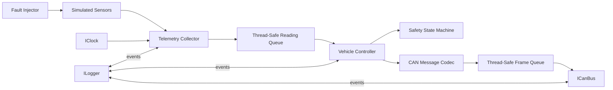
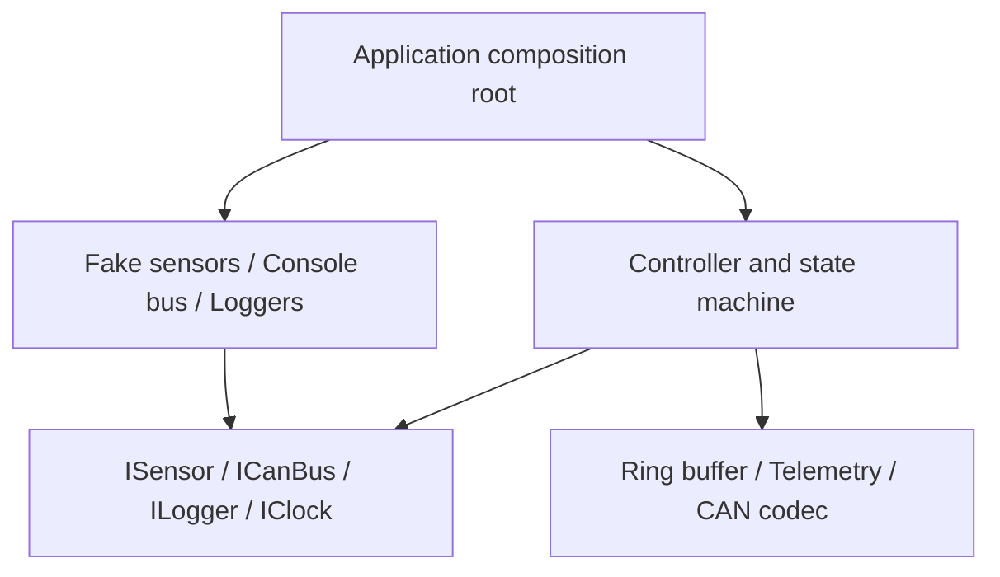
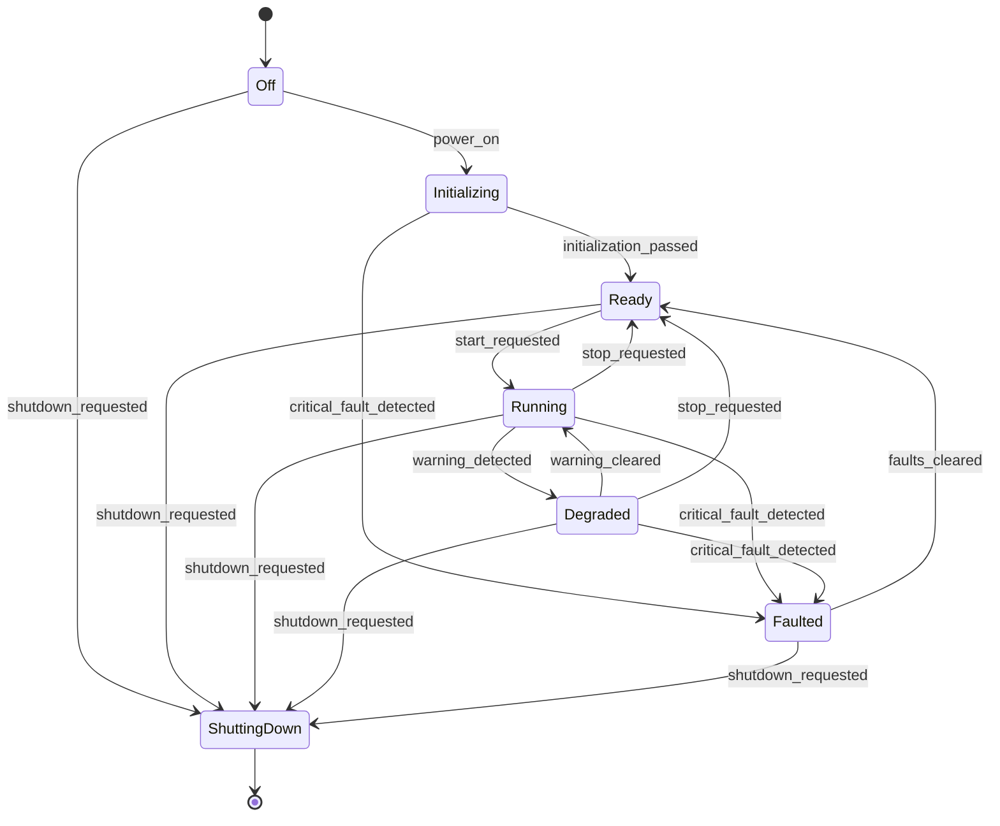
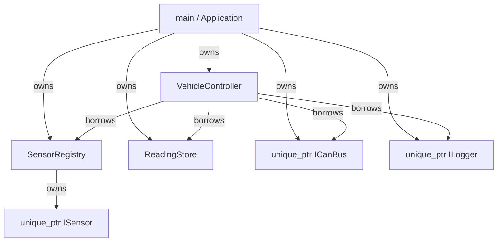
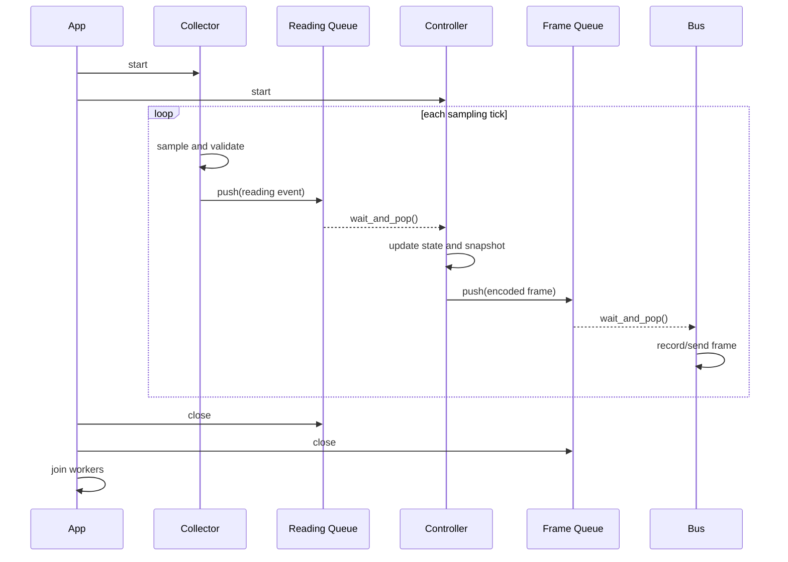

# Project 5: Vehicle Control Simulator

## Project idea

Build a desktop simulation of a small vehicle-control application. Simulated sensors produce readings, the controller evaluates safety rules, messages are encoded as CAN frames, queues move work between components, and a state machine determines whether the vehicle can operate.

This is the integration project. Reuse the earlier projects as libraries instead of copying their implementations into the simulator.

## Learning goals

- Integrate several independently tested libraries.
- Use RAII for threads and other resources.
- Express ownership with smart pointers and borrowing with references.
- Design small interfaces and inject dependencies.
- Synchronize producer and consumer threads safely.
- Define a state machine with explicit events and transitions.
- Separate domain logic from timing, I/O, and logging.
- Implement graceful startup and shutdown.
- Practice debugging behavior that spans multiple components.

Relevant projects and notes:

- [Fixed Buffer](../01_const_correct_fixed_buffer/README.md)
- [Ring Buffer](../02_ring_buffer/README.md)
- [Sensor Telemetry System](../03_sensor_telemetry_system/README.md)
- [Embedded CAN Message Library](../04_embedded_can_message_library/README.md)
- [Constructors, destructors, and RAII](../../04_constructors_destructors_initialization.md)
- [Copying and assignment](../../05_copy_constructor_and_copy_assignment.md)
- [Lifetime and scope](../../08_stack_heap_lifetime_scope_temporaries.md)

## Scenario

Simulate three inputs:

- motor temperature;
- motor speed;
- battery voltage.

The controller periodically samples them and derives a vehicle state:

- `off` — system is inactive;
- `initializing` — dependencies are being checked;
- `ready` — checks passed but the motor is not running;
- `running` — normal operation;
- `degraded` — operation is allowed with a recoverable fault;
- `faulted` — operation is prohibited until faults are cleared;
- `shutting_down` — workers are stopping and queues are closing.

Accepted telemetry is converted into application messages, encoded with the CAN library, and passed to a simulated CAN bus. The simulator logs important events and permits deterministic fault injection.

## Scope boundaries

The first version should be a console program. It does not need:

- a graphical interface;
- real CAN hardware;
- hard real-time guarantees;
- networking;
- persistent databases;
- production automotive safety claims.

Make the simulation correct and deterministic before adding realism.

## System requirements

### Startup and shutdown

- Construct all components before worker threads start.
- Verify required sensors are registered.
- Start workers only after initialization succeeds.
- Stop accepting new work during shutdown.
- Wake blocked workers, drain or discard queued work according to a documented policy, and join every thread.
- Never leave a joinable `std::thread` to be destroyed.

### Sensor collection

- Sample all configured sensors at a controllable interval.
- Validate readings through the telemetry layer.
- Publish accepted readings as events.
- Count and report invalid or missing samples.
- Avoid using wall-clock sleeps in most unit tests; inject a controllable clock or drive one step at a time.

### Control and safety

- Express transitions in one explicit state-machine component.
- Reject events that are illegal in the current state.
- Enter `degraded` for a recoverable warning.
- Enter `faulted` for a critical condition or repeated acquisition failure.
- Prevent a transition to `running` while a critical fault is active.
- Record a reason for every transition.

Example policies, which should be named constants:

- temperature warning at 90 °C and critical at 105 °C;
- battery warning below 11.5 V and critical below 10.5 V;
- sensor critical after three consecutive failures.

These numbers are simulation values, not real vehicle specifications.

### Messaging

- Convert a controller snapshot into a typed CAN application message.
- Encode it using the CAN library.
- Send the frame through an injected `ICanBus` interface.
- Provide `FakeCanBus` for tests and `ConsoleCanBus` for demonstration.
- Treat received or generated malformed frames as data errors rather than undefined behavior.

### Logging

- Define an `ILogger` interface with levels such as debug, info, warning, and error.
- Do not make domain classes depend directly on `std::cout`.
- Provide an in-memory logger for tests.
- Include state transitions and fault activation/clearance in logs.

## Architectural overview



### Dependency rule



The composition root—normally `main()`—creates concrete objects and connects them. Domain classes depend on interfaces, not console or operating-system details.

## Suggested components

### Interfaces

```cpp
class ICanBus {
public:
    virtual ~ICanBus() = default;
    virtual bool send(const can::Frame& frame) = 0;
};

class ILogger {
public:
    virtual ~ILogger() = default;
    virtual void write(LogLevel level, std::string_view message) = 0;
};

class IClock {
public:
    virtual ~IClock() = default;
    virtual std::chrono::steady_clock::time_point now() const = 0;
};
```

These interfaces are injected through constructors. A class that cannot operate without a dependency should not have a default constructor that leaves that dependency missing.

### State machine

```cpp
enum class VehicleState {
    off,
    initializing,
    ready,
    running,
    degraded,
    faulted,
    shutting_down
};

enum class EventType {
    power_on,
    initialization_passed,
    start_requested,
    warning_detected,
    critical_fault_detected,
    warning_cleared,
    faults_cleared,
    stop_requested,
    shutdown_requested
};
```



Make invalid transitions explicit. A handler can return a result containing success, old state, new state, and reason.

### Thread-safe queue adapter

Wrap the ring buffer rather than adding synchronization to the ring-buffer project:

```cpp
template <typename T, std::size_t Capacity>
class BlockingQueue {
public:
    bool push(T value);
    std::optional<T> wait_and_pop();
    void close();
    [[nodiscard]] bool closed() const;

private:
    mutable std::mutex mutex_;
    std::condition_variable not_empty_;
    std::condition_variable not_full_;
    RingBuffer<T, Capacity> buffer_;
    bool closed_{false};
};
```

Define the contract carefully:

- `push()` waits while full, unless the queue is closed;
- `wait_and_pop()` waits while empty, unless the queue is closed;
- `close()` wakes all waiting threads;
- a closed and empty queue returns `std::nullopt`;
- decide whether remaining elements may be drained after closing.

Always use condition-variable predicates because waits may wake without the condition becoming true.

## Ownership design

One reasonable ownership model is:



Prefer direct members when the concrete type and lifetime are fixed. Use `unique_ptr` when runtime polymorphism or optional/dynamic lifetime is actually required. Do not use `shared_ptr` simply to avoid deciding ownership.

## Runtime sequence



## Suggested file layout

```text
05_vehicle_control_simulator/
├── README.md
├── CMakeLists.txt
├── include/vehicle/
│   ├── blocking_queue.hpp
│   ├── can_bus.hpp
│   ├── clock.hpp
│   ├── fault_injector.hpp
│   ├── logger.hpp
│   ├── state_machine.hpp
│   └── vehicle_controller.hpp
├── src/
│   ├── console_can_bus.cpp
│   ├── console_logger.cpp
│   ├── state_machine.cpp
│   ├── vehicle_controller.cpp
│   └── main.cpp
└── tests/
    ├── blocking_queue_tests.cpp
    ├── fakes.hpp
    ├── state_machine_tests.cpp
    └── vehicle_controller_tests.cpp
```

Your build may include the earlier project directories with CMake `add_subdirectory`, or you may temporarily keep them as header-only targets. Preserve a one-way dependency from the simulator to the libraries.

## Where to start

Do not begin with threads. Build the behavior synchronously, test it, and add concurrency last.

### Milestone 1: State machine only

Implement `VehicleState`, events, and a pure transition function or small class. It should have no sensors, CAN frames, threads, or console I/O.

Test every allowed transition and representative rejected transitions. This gives the safety logic a stable foundation.

### Milestone 2: Synchronous controller

Create a `VehicleController::step()` function that accepts readings and emits decisions. Inject fake logger and fake bus objects. Verify warnings, faults, recovery, and encoded output without worker threads.

### Milestone 3: Integrate telemetry

Register deterministic simulated sensors and collect one sample cycle at a time. Feed accepted readings into the controller. Add fault scripts such as:

```text
normal → warning temperature → critical temperature → normal
```

### Milestone 4: Integrate CAN encoding

Map a controller snapshot to the message type from the CAN project. Test the exact generated frame bytes. Keep the bus fake and synchronous.

### Milestone 5: Implement the blocking queue

Wrap the ring buffer with a mutex and condition variables. Test one producer and one consumer, then multiple producers, closure while waiting, full-buffer waiting, and clean draining.

### Milestone 6: Add worker threads

Introduce the collector, controller, and bus workers one at a time. Give each worker an RAII owner whose destructor requests shutdown and joins, or use `std::jthread` and stop tokens when your selected standard and toolchain support them.

### Milestone 7: Graceful shutdown

Exercise shutdown from every vehicle state. Confirm that no worker remains blocked, no thread is left joinable, and the selected queue-draining policy is respected.

### Milestone 8: Scenario runner

Create deterministic named scenarios:

- normal startup, run, stop, and shutdown;
- recoverable temperature warning;
- critical over-temperature fault;
- repeated sensor failure;
- malformed CAN message;
- shutdown while queues contain work.

Print a concise timeline for manual demonstration while keeping assertions in automated tests.

## Testing strategy

### Unit tests

- Every legal state transition produces the expected state.
- Invalid transitions leave state unchanged and report a reason.
- Threshold boundaries are handled exactly.
- A fake sensor sequence produces predictable health changes.
- Controller decisions generate exact message fields.
- Encoded frames match known expected bytes.
- In-memory logs contain expected critical events.

### Queue tests

- FIFO ordering is preserved through wraparound.
- A consumer wakes when an item arrives.
- A producer wakes when capacity becomes available.
- Closing wakes every blocked operation.
- Pushing after close fails.
- Closing an already closed queue is safe.
- No test depends on arbitrary long sleeps; use synchronization signals and bounded timeouts.

### Integration tests

- A complete scripted scenario produces the expected transition sequence.
- Critical sensor input prevents or stops running.
- Valid recovery actions restore the permitted state.
- The bus receives frames in expected order.
- Application shutdown completes within a bounded time.

### Fault injection

Inject faults as data or policies rather than hidden global flags:

- sensor returns `std::nullopt`;
- sensor returns an out-of-range value;
- bus rejects a send;
- queue reaches capacity;
- malformed frame is presented to the decoder;
- logger records an error.

## Hints

- Keep the state transition logic pure when possible: state plus event produces a result. Pure logic is easy to test.
- Constructor injection makes dependencies visible and prevents partially initialized objects.
- Protect each shared invariant with one mutex. Do not read `closed_` outside the same lock that protects the buffer.
- Never hold a queue mutex while calling an external dependency such as the bus or logger.
- A condition variable must wait with a predicate in a loop or predicate overload.
- `volatile` does not make shared data thread-safe. Use mutexes or atomics.
- `std::jthread` is preferable to raw `std::thread` when available because it joins on destruction and supports cooperative stop requests.
- Do not make every component asynchronous. Threads should correspond to an actual concurrency need.
- Preserve deterministic synchronous pathways for most tests.
- Log state changes at their source rather than reconstructing them later.

## Design questions and tradeoffs

1. **One thread or several?** One event loop is simpler and deterministic. Multiple threads practice synchronization and resemble independent producers/consumers, but increase failure modes.
2. **Mutex queue or lock-free queue?** A mutex-based queue is easier to prove correct and is usually the right learning starting point. Lock-free code requires much deeper memory-model reasoning.
3. **References or smart pointers for injected dependencies?** References clearly express required non-null borrowing. `unique_ptr` expresses ownership. A raw pointer may express optional borrowing.
4. **Virtual interfaces or templates?** Virtual interfaces permit runtime substitution and smaller non-template implementation files. Templates can remove virtual dispatch but spread implementation into headers and increase coupling.
5. **Drain or discard on shutdown?** Draining preserves queued work but takes longer. Discarding stops promptly but loses events. Choose and test one explicit policy.
6. **Centralized or distributed state?** One state-machine owner makes transitions auditable. Duplicated state across workers creates synchronization and consistency problems.

## Common failure modes to watch for

- a worker waits forever because shutdown does not notify its condition variable;
- a thread accesses a dependency after that dependency has been destroyed;
- a callback executes while a mutex is held and causes deadlock;
- an exception escapes a thread function and terminates the process;
- state changes without a logged reason;
- a warning and its recovery race and are processed out of order;
- tests rely on timing sleeps and become unreliable;
- ownership is shared everywhere, hiding the intended destruction order;
- domain logic is mixed with console printing and cannot be tested directly.

## Interview practice

- Explain the ownership and destruction order of the entire application.
- Why are interfaces useful for dependency injection?
- What is RAII doing for threads and locks?
- Explain spurious wakeups and condition-variable predicates.
- What data is protected by each mutex?
- What is a data race, and where could one occur here?
- Why is `volatile` not a replacement for synchronization?
- How do you ensure a worker can always stop?
- Why test the controller synchronously before adding threads?
- How would the design change under strict no-allocation and real-time requirements?

## Definition of done

- All earlier libraries are reused through clear public interfaces.
- The state machine is exhaustively unit-tested.
- Normal, warning, critical-fault, recovery, and shutdown scenarios work.
- Dependencies can be replaced with fakes.
- No raw owning pointers or manual `delete` calls exist.
- Every started thread is stopped and joined through RAII.
- Thread-safe queue closure cannot deadlock waiting workers.
- Sanitizers or equivalent diagnostics report no memory or data-race errors where supported.
- You can explain the system's ownership, threading, and state transitions on a whiteboard.

## Optional extensions

- Replace selected worker threads with a single event loop and compare complexity.
- Add configuration loaded at startup while keeping validated typed settings internally.
- Add a bounded event-history buffer.
- Add replay: save a deterministic scenario and run it again.
- Add performance counters for queue depth, dropped work, and processing latency.
- Add C++20 concepts to constrain queue and codec types.
- Add a watchdog component with an injected clock.
- Add a second controller and route frames by CAN ID.

