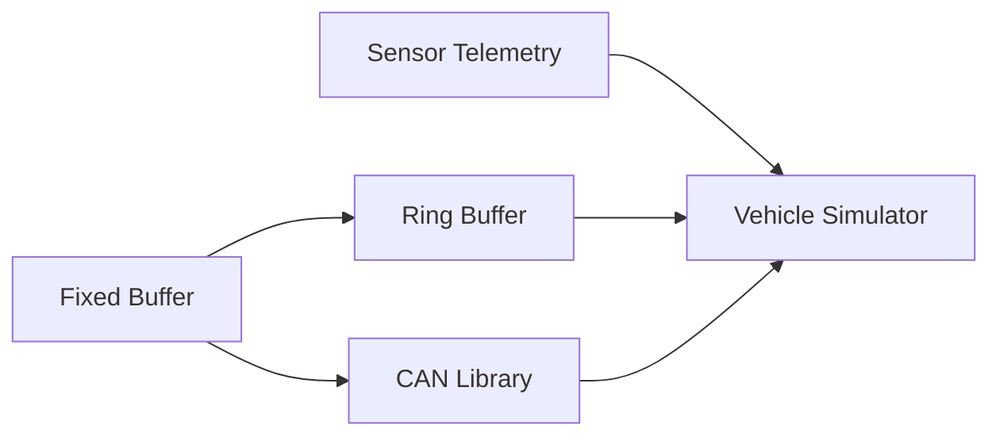

# C++ Practice Projects

These projects turn the concepts in the study notes into working code. Complete them in order: each project introduces a small number of new ideas, while the final project combines the earlier libraries into one system.

| Order | Project | Main focus | Suggested effort |
|---:|---|---|---:|
| 1 | [Const-Correct Fixed Buffer](01_const_correct_fixed_buffer/README.md) | References, `const`, operators, iterators, value semantics | 1–2 days |
| 2 | [Ring Buffer](02_ring_buffer/README.md) | Circular indexing, invariants, templates, copy/move behavior | 2–3 days |
| 3 | [Sensor Telemetry System](03_sensor_telemetry_system/README.md) | Classes, interfaces, STL, algorithms, `std::optional` | 3–5 days |
| 4 | [Embedded CAN Message Library](04_embedded_can_message_library/README.md) | Bytes, bit operations, strong types, encoding and decoding | 3–5 days |
| 5 | [Vehicle Control Simulator](05_vehicle_control_simulator/README.md) | Integration, RAII, dependency injection, threads, state machines | 1–2 weeks |

## Recommended workflow

For every project:

1. Read the project README without writing code.
2. Write down the public interface before implementing it.
3. Build the minimum version described in Milestone 1.
4. Add tests before moving to the next milestone.
5. Compile with warnings enabled.
6. Run the program with a memory/error checker when one is available.
7. Explain the design aloud as if answering an interview question.

A useful compiler baseline is C++20 with strict warnings:

```text
-std=c++20 -Wall -Wextra -Wpedantic -Wconversion -Wshadow
```

Compiler flags differ between GCC, Clang, and MSVC, so adjust them for your toolchain.

## Dependency direction



The first four projects should remain independently buildable. The vehicle simulator may consume their public headers, but those libraries should never depend on the simulator.

